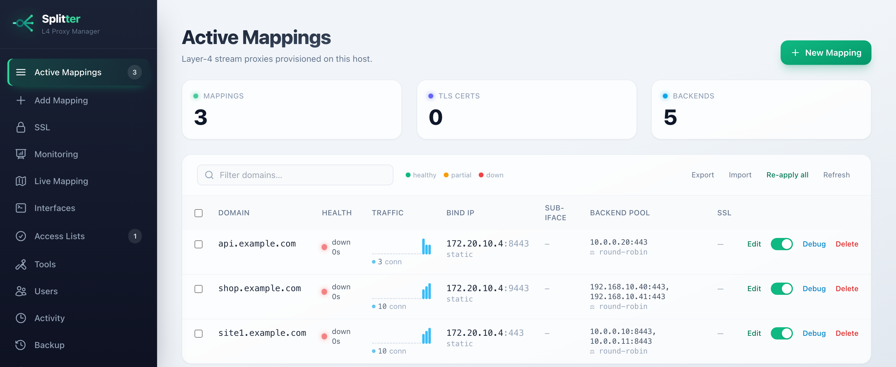
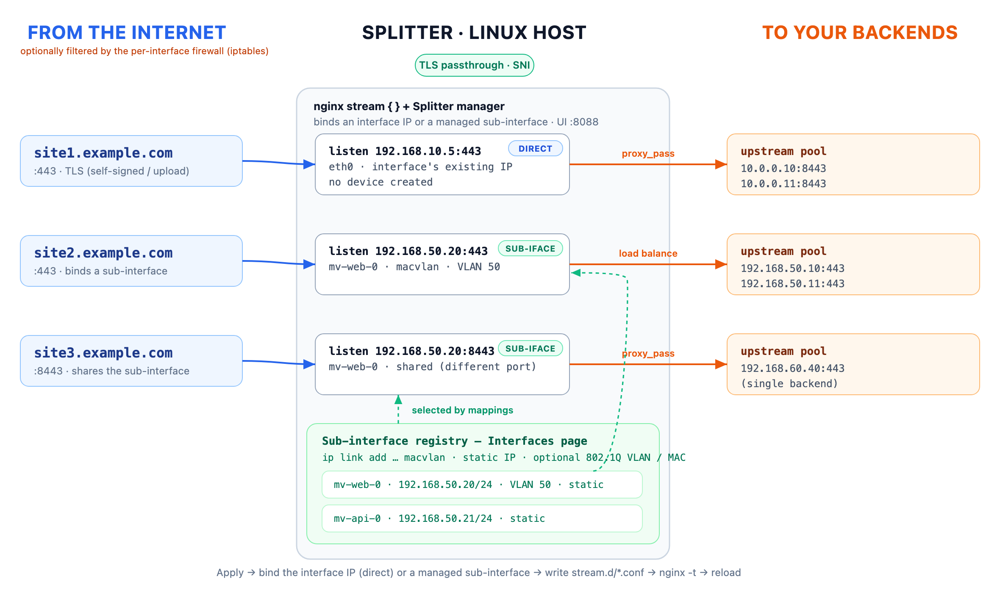
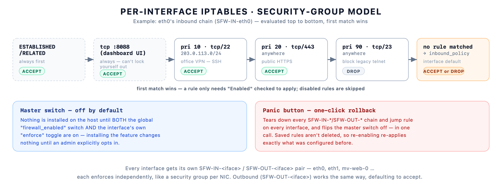

<p align="center">
  <picture>
    <source media="(prefers-color-scheme: dark)" srcset="docs/logo-white.png">
    
  </picture>
</p>

<p align="center">Layer-4 Stream Proxy Manager</p>

---

**Splitter turns a Linux box into a multi-IP Layer-4 (TCP/UDP) reverse proxy you
drive from a browser.** Type a domain, pick an interface (or a dedicated
sub-interface you provisioned), point an Nginx `stream` upstream pool at your
backends, and it reloads — all in a few seconds, no manual `ip` or config editing.

<p align="center">
  
</p>

By default a mapping **binds Nginx directly to the chosen interface's existing
IP** (no device created). For a **dedicated IP per mapping**, enable
sub-interfaces on the Interfaces page and provision a real **`macvlan`**
device — its own MAC (optionally inside an 802.1Q **VLAN**), a static address,
visible in `ip link show` — then bind a mapping to it. On every **Save / Apply**
the host then:

1. **Resolves the bind IP** — the interface's address, or the selected
   sub-interface's.
2. **Generates** `/etc/nginx/stream.d/<domain>.conf` with an `upstream {}` pool.
3. **Validates** (`nginx -t`) and **reloads nginx** (`nginx -s reload`; a full
   `nginx -s stop` + start if a reload doesn't bind the new IP).

Because it runs **directly on the host** (no container namespaces), the
interfaces and IPs are **real and reachable** and nginx — on the same host —
binds them directly. Built with **Python + Flask** and a **Tailwind** single-page
UI; no database (mappings and users persist to JSON). The dashboard streams back a
step-by-step log of exactly which commands ran.

### Features
- **Login & roles** — first run prompts you to create an **admin**; after that
  the whole UI requires login. Admins can add **admin** or **creator** users.
  Creators add/edit mappings and export; admins also delete, import, re-apply,
  and manage users.
- **Dynamic interface detection** — discovers physical & VLAN interfaces
  (`ip -j addr`) and offers them in a dropdown.
- **Interfaces page** — a global **sub-interface toggle** (default **off**: a
  mapping binds straight to the chosen interface's existing IP, no device is
  created). With it **on**, you **create/edit/delete static macvlan
  sub-interfaces** here as managed resources, and a mapping just **selects an
  existing sub-interface** to bind (several mappings can share one on different
  ports; an in-use sub-interface can't be edited/deleted). The page also lets you
  view/edit host **DNS** and **`/etc/hosts`** and shows a **live per-interface
  upload/download** tree (physical at the top, sub-interfaces nested).
- **Network tools** — a built-in **Tools** page for ping, port test, DNS lookup,
  traceroute, packet capture (tcpdump) and WHOIS, run from the host.
- **Live routing map** — the Monitoring page renders an n8n-style canvas of every
  mapping (inbound IP → splitter → backend pool), with draggable nodes, pan/zoom,
  click-to-expand backend pools, and **red/✗ flagging when a backend is down**.
- **Real macvlan sub-interfaces with unique MACs** (`mv-<domain>-<n>`), random
  locally-administered or custom MAC.
- **802.1Q VLAN tagging** — give a VLAN ID and it creates `eth0.<id>` and builds
  the macvlan on top.
- **Static IP** sub-interfaces (each macvlan gets a fixed address).
- **Backend load-balancing pool** — one or many `IP:PORT` rendered as `upstream {}`,
  with a selectable method: round-robin, `least_conn`, `hash $remote_addr`
  (+ `consistent`), `random`, or `random two least_conn`. The method options
  **auto-reveal once a mapping has 2+ backends** (a single backend just uses
  round-robin).
- **Rate limiting (Layer 4)** — an optional per-mapping toggle that caps
  **simultaneous connections per client IP** (`limit_conn` + an auto-generated
  `limit_conn_zone`) and **per-connection bandwidth** (`proxy_download_rate` /
  `proxy_upload_rate`, e.g. `1m` / `512k`).
- **Automated SSL** — upload your own cert/key, generate a SAN self-signed cert
  with `openssl`, or **reuse an existing** managed cert across multiple mappings
  (shared certs are kept until the last user is removed).
- **Access lists (allow/deny)** — restrict who may connect to a mapping at
  Layer 4. Create named IP/CIDR allow lists on the **Access Lists** page, then a
  mapping selects one (or the **global default**) — only those networks connect,
  everything else is denied. A built-in **tas-ix (Uzbekistan)** list ships by
  default and **auto-refreshes in the background** from the MRLG looking glass
  (any list can set its own source URL), replacing the manual
  `iplist.sh`/`allow.sh` cron. See [Access lists](#access-lists) below.
- **Firewall (per-interface iptables)** — security-group style rules: every host
  interface gets its **own** ordered rule set (protocol, port/range, source CIDR,
  accept/drop/reject, priority) plus a configurable default (fallback) policy for
  inbound and outbound. A global master switch and a per-interface enforce toggle
  are both **off by default**, so installing it changes nothing until an admin
  opts in. Every managed chain always allows established connections and this
  dashboard's own port first, and a one-click **Panic** button tears every
  managed chain down instantly. See [Firewall](#firewall) below.
- **Backup / restore** — **Export** all mappings to a JSON file, **Import** them
  back, and **Re-apply all** to re-provision every mapping onto the host (handy
  after a redeploy or a reboot).
- **Full-system backup page** — one-click **snapshot** of *everything* (mappings,
  users, certificates, sub-interfaces, settings, audit log **and** SSL keys) as a
  timestamped zip you can download, restore, or roll back to. **Scheduled
  automatic backups** (interval + retention) run in-process — no system cron — so
  you can recover the whole tool to any saved point in time. (Backups contain
  secrets; admin-only and stored under the data dir.)

---

## Architecture

Each domain gets its **own sub-interface (unique MAC/IP)** on the host; nginx
`stream` listens on that IP and load-balances across the domain's backend pool.

<p align="center">
  
</p>

---

## Requirements

- A **Linux host** (Debian/Ubuntu, RHEL/Fedora, Arch, openSUSE).
- **root** (the tool runs `ip`, writes `/etc/nginx`, drives nginx, and — if you
  turn it on — manages `iptables` chains for the Firewall page).
- nginx with the **stream module**, python3, iproute2, a DHCP client, openssl,
  **iptables** — all installed for you by `setup.sh`.

---

## Quick start (Linux)

```bash
git clone <repo> splitter && cd splitter
sudo ./setup.sh --service        # installs deps, configures nginx + kernel, starts the service
```

Then open **`http://<server-ip>:8088`** and create the admin account on first load.

`setup.sh` is idempotent and safe to re-run. It:
- installs dependencies (nginx + stream module, python3/venv, iproute2, dhcp
  client, openssl) for your distro,
- creates `/etc/nginx/stream.d` and `/etc/nginx/ssl`,
- adds the top-level `stream { include /etc/nginx/stream.d/*.conf; }` to
  `nginx.conf` (if absent), then `nginx -t` + reload,
- creates the persistent data dir **`/var/lib/splitter`** (outside the repo, so a
  redeploy never wipes mappings/users) and migrates any old in-repo store,
- enables **`net.ipv4.ip_nonlocal_bind`** (`/etc/sysctl.d/99-splitter.conf`) so
  nginx can bind a freshly-added IP that hasn't fully settled yet, and orders
  nginx after `network-online` + `systemd-sysctl`,
- builds the Python venv,
- detects your default interface,
- with `--service`, installs and starts a **systemd** unit (running as root).

### Run without installing a service
```bash
sudo ./setup.sh                  # configure only
sudo ./run.sh                    # foreground (creates venv, runs the app)
```

### setup.sh options
| Flag | Meaning |
|---|---|
| `--service` | Install + enable the systemd service. |
| `--nic NAME` | Force the parent interface (else auto-detected). |
| `--host ADDR` | UI bind address (default `0.0.0.0` = all interfaces). |
| `--port N` | UI port (default `8088`). |
| `--no-deps` | Skip package installation. |

### Service management
```bash
systemctl status splitter
journalctl -u splitter -f        # apply failures are logged here with the failing step
systemctl restart splitter       # do this after every `git pull` so new code is loaded
```

> The UI binds `0.0.0.0:8088` by default and is **protected by login**. It still
> performs privileged host actions, so restrict it to a trusted network (or put
> it behind an authenticated reverse proxy / SSH tunnel and set
> `--host 127.0.0.1`). Use a strong admin password.

### WAF (ModSecurity + OWASP CRS) — install from the dashboard

Splitter can front the UI with a self-hosted WAF: nginx terminates TLS on port
**8443**, filters every request through ModSecurity/CRS (SQLi, XSS, RCE, …) with
per-IP rate limits on the login endpoint, and proxies to the app.

`setup.sh` does **not** install it — you enable it when you want it, from the
**WAF page in the dashboard** (admin only): click **Install / Repair**, then
switch Off / Detection / Enforce, change the listen port and rate limits, and
review recent ModSecurity events. The Install button runs `setup.sh --waf-only`
on the server, so you never need the CLI.

```bash
# Optional CLI equivalents:
sudo ./setup.sh --waf          # install the WAF as part of setup
sudo ./setup.sh --waf-only     # install/repair just the WAF (what the UI runs)
sudo ./setup.sh --waf-enforce  # switch from Detection to blocking mode
```

It starts in **DetectionOnly** (logs, never blocks) so it can't lock you out.
On stock Debian/Ubuntu the modsecurity-nginx connector isn't packaged, so the
installer compiles it as a dynamic module matching your nginx (build tools
installed automatically; ~2–4 min, one time). The engine mode lives in
`/etc/nginx/modsec/modsecurity.conf`; the server block is
`/etc/nginx/conf.d/splitter-waf.conf`.

#### Protecting your mapped apps with the WAF

The WAF page also lists your mappings under **Protected apps**, where you can
**Bind** / **Unbind** the WAF per app. Binding switches that mapping from its L4
`stream` proxy to an L7 **HTTP reverse proxy** that terminates TLS and runs the
request through ModSecurity/CRS before forwarding to your backend.

Only **HTTPS mappings are eligible** — a WAF has to read HTTP, so:
- TLS-terminating TCP mappings → **eligible** (Bind available).
- UDP or TLS-passthrough mappings → **not eligible** (nothing to inspect).

A bound app renders to `/etc/nginx/conf.d/splitter-app-<domain>.conf` (an
`http{}` server block); unbinding restores its `stream.d` block. Your access
lists and the mapping's cert carry over. Expect to tune CRS false positives per
app (in Detection) before enforcing.

---

## Redeploy / upgrade

```bash
cd ~/splitter
git pull
sudo ./setup.sh                  # picks up any new system/kernel config (idempotent)
sudo systemctl restart splitter  # IMPORTANT: load the new code
```

Mappings and users live in **`/var/lib/splitter`**, so they survive a redeploy.
The `/etc/nginx/stream.d/*.conf` files also persist. If you ever need to rebuild
the host's interfaces/configs from the stored mappings, use **Re-apply all** in
the UI (or `POST /api/reapply`).

---

## Using it

1. **Log in** (create the admin on first run).
2. **Domain** — `site4.example.com`
3. **Bind target** —
   - with the sub-interface toggle **off** (default): pick a **physical
     interface** and the mapping binds its existing IP;
   - with it **on**: pick a **sub-interface** you created on the Interfaces page.
4. **Backend Pool** — one or more `host:port` (host and port in separate fields;
   **+ Add Backend**). Adding a second backend auto-opens the **Load balancing**
   method options. An optional **Rate limit** switch adds per-IP connection and
   bandwidth caps.
5. **SSL** — None / Upload / Auto Self-Signed / Use Existing
6. **Access list** — *Use global default*, *None — allow all*, or a specific
   list (manage them on the **Access Lists** page)
7. **Preview** the generated config, or **Save / Apply**

To provision a dedicated IP, first enable sub-interfaces on the **Interfaces**
page and create a static macvlan sub-interface (parent interface, optional VLAN,
optional MAC, bind IP) — then select it when adding a mapping.

Each apply shows a step-by-step log; the table lists every mapping with an
**Edit** button and (for admins) a **Delete** button (which tears the
interface/VLAN/cert back down and reloads). The header has **Export**,
**Import**, and **Re-apply all** (admins), plus logout and change-password.

Generated config:

```nginx
# Automatically generated Stream Proxy Cluster
upstream upstream_924cb235c2 {
    server 192.168.50.10:443;
    server 192.168.50.11:443;
}

server {
    listen 192.168.50.15:443;
    include /etc/nginx/acl.d/_default.conf;   # only when an access list is selected
    proxy_pass upstream_924cb235c2;
    proxy_timeout 10m;
    proxy_connect_timeout 5s;
}
```

The provisioning pipeline (matches the manual commands you'd run):
```bash
ip link add link eth0 name eth0.50 type vlan id 50          # if VLAN ID given
ip link add link eth0.50 name mv-site4-0 address 52:54:00:fa:bb:04 type macvlan mode bridge
ip link set mv-site4-0 up
ip addr add 192.168.50.15/24 dev mv-site4-0                 # or: dhclient mv-site4-0
sysctl -w net.ipv4.ip_nonlocal_bind=1                       # bind not-yet-up IPs
nginx -t && nginx -s reload                                 # stop+start if reload won't bind
```

---

## Access lists

The **Access Lists** page (admin) manages IP/CIDR allow lists. Each list is
rendered to one nginx snippet — `/etc/nginx/acl.d/<name>.conf` — holding `allow`
lines and a final `deny all;`. A mapping's stream `server {}` block then pulls in
the one it selected with `include`, so only the listed networks may connect.

- **Create your own** — give the list a name (becomes the `<name>.conf`
  filename), paste CIDRs (one per line; `#` comments allowed), and optionally
  keep **Allow loopback** on (appends `127.0.0.1/32` so the host can reach its
  own mappings). RFC-1918 ranges are *not* added automatically — list them
  explicitly if you need them.
- **Auto-refresh** — set a **Source URL** and the list re-fetches its CIDRs in
  the background on an interval (default 24 h). The built-in **`tasx`**
  (tas-ix / Uzbekistan) list ships with this enabled, fetching from the MRLG
  looking glass exactly like the original `iplist.sh` — no cron needed.
- **Global default** — pick a default list; every mapping set to *Use global
  default* follows it (via a managed `_default.conf` mirror), so changing the
  default updates them all with **no re-apply**.
- A mapping can instead choose a **specific** list, or **None — allow all**.
- A list that's in use by a mapping can't be deleted; the built-in `tasx` can be
  refreshed/edited but not deleted.

Generated snippet (`/etc/nginx/acl.d/tasx.conf`):

```nginx
# Access list 'tasx' — tas-ix (Uzbekistan)
# Managed by Splitter; do not edit by hand.
# Source: http://mrlg.tas-ix.uz/index.php  (refreshed 2026-06-26T00:00:00Z)
allow 82.148.0.0/21;
allow 217.30.160.0/20;
# … (hundreds more)

# Loopback
allow 127.0.0.1/32;

deny all;
```

---

## Firewall

The **Firewall** page (admin) manages **per-interface iptables rules** — every
host interface (physical, VLAN, or a Splitter-managed sub-interface) gets its
**own** ordered rule set, the same mental model as an AWS/Azure security group:
rules are evaluated top to bottom, the first match wins, and whatever doesn't
match falls through to that interface's configurable default policy.

<p align="center">
  
</p>

- **Two safety switches, both off by default** — a global master switch
  (`firewall_enabled`) and each interface's own **enforce** toggle. Installing
  or upgrading to this feature changes **no** host behaviour until an admin
  turns both on for a given interface.
- **Built-in lockout protection** — every managed chain always allows
  `ESTABLISHED,RELATED` traffic and this dashboard's own port **first**, before
  any rule is evaluated, so a bad rule can drop other services on that
  interface but can't lock you out of Splitter itself.
- **A rule** has a direction (inbound/outbound), protocol (`tcp`/`udp`/`icmp`/
  `all`), an optional port or port range (blank = any), a source CIDR (blank =
  anywhere), an action (`accept`/`drop`/`reject`), a priority (lower runs
  first), and can be disabled without deleting it.
- **Panic button** — instantly tears down every `SFW-IN-*`/`SFW-OUT-*` chain and
  jump rule on every interface and flips the master switch off, in one call.
  Saved rules aren't deleted, so re-enabling re-applies exactly what was
  configured before.
- Implemented entirely with **iptables** — no nftables/ufw/firewalld dependency.
  Each interface gets two custom chains, `SFW-IN-<iface>` and
  `SFW-OUT-<iface>`, hooked into `INPUT`/`OUTPUT` with a single jump rule. A
  chain is fully **flushed and rebuilt** from the stored rule set on every
  apply, so it's always safe to re-run and never drifts from what's configured.
  On boot the app **re-applies every enabled interface** automatically (unless
  the master switch is off), the same self-healing pattern used for access
  lists.

Example: an interface with **inbound default = Drop** and two accept rules
(SSH from an office CIDR, public HTTPS) renders to:

```bash
iptables -N SFW-IN-eth0
iptables -F SFW-IN-eth0
iptables -A SFW-IN-eth0 -m conntrack --ctstate ESTABLISHED,RELATED -j ACCEPT
iptables -A SFW-IN-eth0 -p tcp --dport 8088 -j ACCEPT      # this dashboard, always
iptables -A SFW-IN-eth0 -p tcp --dport 22 -s 203.0.113.0/24 -j ACCEPT
iptables -A SFW-IN-eth0 -p tcp --dport 443 -j ACCEPT
iptables -A SFW-IN-eth0 -j DROP                            # fallback = inbound_policy
iptables -I INPUT 1 -i eth0 -j SFW-IN-eth0
```

Outbound (`SFW-OUT-eth0`) works the same way and defaults to **Accept** (allow
all outbound), matching the usual security-group convention.

---

## Project layout

```
splitter/
├── backend/                  # Python backend
│   ├── app.py                #   Flask app + REST API + auth
│   ├── auth.py               #   User accounts (JSON), roles, password hashing
│   ├── config.py             #   Settings (env-overridable)
│   ├── validators.py         #   Domain / IP / MAC / VLAN validation
│   ├── storage.py            #   Atomic JSON persistence (mappings, sub-ifaces, settings…)
│   ├── net_detect.py         #   Host interface / VLAN discovery
│   ├── net_settings.py       #   Host DNS (/etc/resolv.conf) + /etc/hosts read/write
│   ├── nginx_manager.py      #   The only module that touches the OS
│   ├── metrics.py            #   Host + per-interface resource metrics
│   ├── health.py             #   Backend reachability probes
│   ├── activity.py           #   Audit / activity log
│   ├── backup.py             #   Full-system backup/restore + scheduler
│   ├── access.py             #   Access lists: tas-ix fetch/parse + refresh scheduler
│   ├── failover.py           #   Active-passive backend priority failover orchestration
│   ├── firewall.py           #   Per-interface iptables chains (Firewall page)
│   └── requirements.txt
├── frontend/                 # Single-page UI
│   ├── templates/index.html  #   Tailwind dashboard
│   ├── templates/auth.html   #   Login / first-run setup page
│   └── static/app.js
├── deploy/                   # Reference unit/sudoers/nginx snippet
│   ├── splitter.service
│   ├── splitter.sudoers      #   least-privilege sudo (non-root option)
│   └── nginx-stream-include.conf
├── setup.sh                  # one-shot installer (deps + nginx + kernel + venv + service)
└── run.sh                    # venv bootstrap + foreground launch
```

State on the host:

```
/var/lib/splitter/mappings.json     # the mappings (survives redeploys)
/var/lib/splitter/users.json        # accounts (hashed passwords)
/var/lib/splitter/owned_vlans.json  # VLANs the tool created (for safe teardown)
/var/lib/splitter/subinterfaces.json # managed macvlan sub-interfaces
/var/lib/splitter/settings.json     # tool-wide settings (e.g. subinterface_enabled, firewall_enabled)
/var/lib/splitter/firewall_rules.json      # per-interface iptables rules (Firewall page)
/var/lib/splitter/firewall_interfaces.json # per-interface enforce toggle + default policies
/var/lib/splitter/backups/*.zip     # full-system backup snapshots
/etc/nginx/stream.d/<domain>.conf   # generated stream configs
/etc/nginx/ssl/<domain>.{crt,key}   # managed certificates
```

---

## Configuration (environment variables)

| Variable | Default | Purpose |
|---|---|---|
| `SPLITTER_NIC` | auto / `eth0` | Default parent interface. |
| `SPLITTER_BIND_PREFIX` | `24` | CIDR prefix for static IPs (e.g. `29` for a /29 block). |
| `SPLITTER_DATA_DIR` | `/var/lib/splitter` (root) | Where `mappings.json` / `users.json` live. **Keep it outside the repo** so redeploys don't wipe data. |
| `SPLITTER_STREAM_DIR` | `/etc/nginx/stream.d` | Where `.conf` files are written. |
| `SPLITTER_SSL_DIR` | `/etc/nginx/ssl` | Where cert/key are saved. |
| `SPLITTER_RESOLV_CONF` | `/etc/resolv.conf` | DNS file the Interfaces page reads/writes. |
| `SPLITTER_HOSTS_FILE` | `/etc/hosts` | Hosts file the Interfaces page reads/writes. |
| `SPLITTER_DEFAULT_BACKEND` | `192.168.10.10:443` | Pre-filled backend. |
| `SPLITTER_DHCP_ACQUIRE_CMD` | `timeout 25 dhclient -1 {iface}` | DHCP client command (`{iface}` substituted). Use `dhcpcd -1 -t 20 {iface}` etc. |
| `SPLITTER_DHCP_RELEASE_CMD` | `dhclient -r {iface}` | DHCP release on delete. |
| `SPLITTER_SUDO` | `""` if root else `sudo` | Prefix for privileged commands. |
| `SPLITTER_RELOAD_CMD` | `""` → `nginx -s reload` | How nginx is reloaded. Set to `systemctl reload nginx` to use systemd instead. |
| `SPLITTER_RESTART_CMD` | `""` → `nginx -s stop` + start | Restart used when a reload doesn't bind a new IP. Set to `systemctl restart nginx` to use systemd. |
| `SPLITTER_IP_NONLOCAL_BIND` | `1` (on) | Set `net.ipv4.ip_nonlocal_bind` at apply time so nginx can bind an address that isn't fully up yet. |
| `SPLITTER_HOST` / `SPLITTER_PORT` | `0.0.0.0` / `8088` | UI bind. |
| `SPLITTER_SIMULATE` | auto | `1` = dry-run (no system commands); auto-on when not on a Linux nginx host. |

---

## Running as a non-root user (optional)

The default (and the systemd unit) runs as **root**, where no sudo is needed.
To run unprivileged instead, install `deploy/splitter.sudoers` (it grants only
the exact commands the tool needs — `ip addr`/`ip link`, `nginx -t`/`-s reload`/
`-s stop`/start, `sysctl ip_nonlocal_bind`, `dhclient`, and the scoped
`iptables -N`/`-F`/`-X`/`-A`/`-I`/`-D`/`-C` used by the Firewall page):

```bash
sudo cp deploy/splitter.sudoers /etc/sudoers.d/splitter
sudo chmod 0440 /etc/sudoers.d/splitter
sudo visudo -cf /etc/sudoers.d/splitter        # validate
```

then set `User=splitter` in the unit and `SPLITTER_SUDO=sudo`.

---

## REST API

All `/api/*` routes require an authenticated session except the auth/setup ones.

| Method | Path | Role | Description |
|---|---|---|---|
| `GET` | `/login` | — | Login / first-run setup page. |
| `GET` | `/api/auth/status` | — | Whether setup is needed / who is logged in. |
| `POST` | `/api/setup` | — | Create the initial admin (first run only). |
| `POST` | `/api/login` / `/api/logout` | — | Start / end a session. |
| `GET` | `/api/config` | any | Effective config + mode. |
| `GET` | `/api/interfaces` | any | Detected host interfaces (physical + VLAN). |
| `GET` | `/api/interfaces/traffic` | admin, creator | Live upload/download per interface (sub-interfaces nested). |
| `GET` | `/api/subinterfaces` | admin, creator | List managed sub-interfaces (with `in_use`). |
| `POST` | `/api/subinterfaces` | admin | Create + provision a static sub-interface. |
| `POST` | `/api/subinterfaces/<name>` | admin | Edit/re-provision (blocked while in use). |
| `DELETE` | `/api/subinterfaces/<name>` | admin | Tear down + remove (blocked while in use). |
| `GET` / `POST` | `/api/settings` | any / admin | Read / change tool-wide settings (`subinterface_enabled`, `default_access_list`). |
| `GET` / `POST` | `/api/network/dns` | admin | View / edit `/etc/resolv.conf` nameservers. |
| `GET` / `POST` | `/api/network/hosts` | admin | View / edit `/etc/hosts`. |
| `POST` | `/api/tools/ping` / `port` / `dns` / `traceroute` / `whois` | admin, creator | Network diagnostics run on the host. |
| `POST` | `/api/tools/tcpdump` | admin | Short packet capture on an interface. |
| `GET` | `/api/random-mac` | any | A random locally-administered MAC. |
| `GET` | `/api/mappings` | any | List mappings. |
| `POST` | `/api/mappings` | admin, creator | Create/update + provision (multipart form). |
| `DELETE` | `/api/mappings/<domain>` | admin | Deprovision + remove. |
| `POST` | `/api/preview` | any | Render the conf without applying. |
| `GET` | `/api/access-lists` | any | List access lists + the global default (for the page and the mapping dropdown). |
| `GET` | `/api/access-lists/<name>` | admin | Full record incl. CIDR entries (edit form). |
| `POST` | `/api/access-lists` | admin | Create / edit a list; writes its `<name>.conf` + reloads. |
| `POST` | `/api/access-lists/<name>/refresh` | admin | Re-fetch an auto-refreshing list now. |
| `DELETE` | `/api/access-lists/<name>` | admin | Remove a list (blocked if in use / built-in). |
| `GET` | `/api/firewall/overview` | admin, creator | Every interface + its firewall settings/rule count, plus the master switch. |
| `POST` | `/api/firewall/settings` | admin | Flip the global master switch (applies/tears down every enabled interface). |
| `POST` | `/api/firewall/interfaces/<name>` | admin | Set an interface's enforce toggle + inbound/outbound default policy. |
| `GET` | `/api/firewall/rules` | admin, creator | List rules (optionally `?interface=`). |
| `POST` | `/api/firewall/rules` | admin | Create a rule (direction, protocol, port range, source, action, priority). |
| `POST` | `/api/firewall/rules/<id>` | admin | Edit a rule. |
| `DELETE` | `/api/firewall/rules/<id>` | admin | Delete a rule. |
| `POST` | `/api/firewall/panic` | admin | Tear down every managed chain and disable the master switch. |
| `GET` | `/api/backup` | any | Download all mappings as JSON (legacy, mappings-only). |
| `POST` | `/api/import` | admin | Restore mappings from a JSON backup. |
| `GET` / `POST` | `/api/backups` | admin | List / take a full-system snapshot (zip of all data + SSL). |
| `GET` | `/api/backups/download` | admin | Download a stored backup (`?name=`) or a fresh one (`?now=1`). |
| `POST` | `/api/backups/restore` | admin | Restore from a stored backup (`name`) or an uploaded `file`. |
| `DELETE` | `/api/backups/<name>` | admin | Delete a stored backup. |
| `POST` | `/api/backups/schedule` | admin | Configure automatic backups (enable / interval / retention). |
| `POST` | `/api/reapply` | admin | Re-provision every stored mapping onto the host. |
| `GET` / `POST` | `/api/users` | admin | List / create users. |
| `DELETE` | `/api/users/<username>` | admin | Remove a user. |
| `POST` | `/api/account/password` | any | Change your own password. |

Each provisioning response includes a `steps[]` array (`name, ok, detail`) so
the UI shows exactly what happened; failures are also logged to `journalctl`.

---

## Notes & safety

- **Login required** — passwords are stored only as salted PBKDF2 hashes; the
  last admin can't be deleted; sessions are cookie-only (expire on browser close).
- **No shell injection** — every command runs as an argv list, never a shell string.
- **Validated input** — domains (RFC-1123), IPs (`ipaddress`), `host:port`
  backends, MACs (unicast) and VLAN IDs (1–4094); domains are path-sanitised.
- **Fail-safe reloads** — `nginx -t` runs before every reload; a bad block is
  rolled back so the live proxy is never reloaded against a broken config.
- **Atomic writes** for the store; **0600** for private keys.
- **Firewall lockout protection** — the per-interface iptables rules are off by
  default (both a master switch and a per-interface toggle), every managed
  chain always allows established connections and the dashboard's own port
  first, and the **Panic** button instantly tears every managed chain down.
- For externally-reachable IPs, the IP block must be routed to the host and
  `SPLITTER_BIND_PREFIX` must match it. macvlan answers ARP with its own MAC, so
  other hosts on the segment reach it — note some networks (e.g. phone hotspots)
  block extra MAC addresses.

---

## Troubleshooting

- **`bind() ... (99: Cannot assign requested address)`** — the bind IP wasn't
  fully up when nginx (re)started. Ensure `ip_nonlocal_bind` is on:
  `sysctl net.ipv4.ip_nonlocal_bind` should print `1` (re-run `setup.sh`, or
  `sudo sysctl -p /etc/sysctl.d/99-splitter.conf`).
- **A change "didn't take"** — after `git pull`, run `sudo systemctl restart
  splitter` so the service loads the new code.
- **An apply returns 500** — `journalctl -u splitter -f` logs the failing step
  and its error; the UI's *Provisioning Steps* panel shows the same.

---

## License

Released under the [MIT License](LICENSE) — © 2026 Splitter Contributors.
